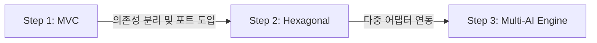

# 🤖 ARChat (Architecture Chatbot)

이 프로젝트는 **MVC 패턴에서 출발하여 헥사고날(클린) 아키텍처로 점진적으로 진화**하는 과정을 학습하기 위한 예습용 AI 챗봇 토이 프로젝트입니다.

---

## 🛠️ Tech Stack & Architecture


---

## 🚀 아키텍처 진화 로드맵



### 1. [Step 1: MVC 패턴 (Legacy)](file:///Users/morgan/Documents/workspace/archat/step1_mvc.md)
* JSP와 Servlet API를 직접 사용하는 전통적인 MVC 모델 2 아키텍처.
* 톰캣 세션 ID(`HttpSession`) 기반의 인메모리 대화 히스토리 관리.
* 서비스 레이어가 Google GenAI SDK에 직접 의존하여 결합도가 높은 상태.

### 2. [Step 2: 헥사고날 아키텍처 (Clean)](file:///Users/morgan/Documents/workspace/archat/step2_clean.md)
* 의존성 역전 원칙(DIP)을 이용해 비즈니스 로직과 외부 인프라(DB, 외부 API) 격리.
* **Ports & Adapters** 패턴을 활용해 의존성이 항상 코어(Domain/Application)로 흐르도록 통제.
* 구체 라이브러리(Gemini SDK)가 외부 어댑터로 격리되어 비즈니스 로직 보호.

### 3. Step 3: 다중 AI 엔진 지원 (진행 중)
* 헥사고날 아키텍처의 다형성 어댑터 구조를 응용해 다중 AI 모델 서비스 연동.
* 사용자가 선택한 모델에 따라 **Gemini/Gemma**(`GenAIChatProvider`) 또는 **Groq API**(`GroqChatProvider`)로 분기 처리.

---

## 📂 패키지 구조 (헥사고날 기준)

```
src/main/java/com/example/archat/
├── domain/                      # 순수 비즈니스 규칙 및 도메인 모델
│   ├── model/Chat.java          # 불변 대화 데이터 객체 (Record)
│   ├── repository/              # 데이터 영속 포트 (Interface)
│   └── service/ChatService.java # 도메인 비즈니스 서비스 인터페이스
│
├── application/                 # 유즈케이스 조율 및 아웃바운드 포트
│   ├── port/                    # 외부 인프라와 소통하기 위한 포트 명세
│   │   ├── ChatProvider.java    # AI 연동용 포트
│   │   └── ChatPublisher.java   # 이벤트 등 발행용 포트
│   └── service/                 # 애플리케이션 서비스 구현체 (오케스트레이션)
│
├── infrastructure/              # 기술 및 외부 프레임워크 구현체 (Outbound Adapter)
│   ├── api/                     # Google GenAI, Groq 연동 어댑터
│   └── repository/              # ConcurrentHashMap 기반 인메모리 저장소 어댑터
│
└── presentation/                # 웹 인입 처리 (Inbound Adapter)
    └── controller/              # HTTP 서블릿 컨트롤러 및 화면 처리
```

---

## ⚙️ 환경변수 설정

AI 엔진 호출을 위해 로컬 OS 환경 변수에 API Key를 등록해야 합니다.

```bash
# MacOS / Linux (.zshrc 또는 .bashrc)
export GEMINI_API_KEY="your-gemini-api-key"
export GROQ_API_KEY="your-groq-api-key"
```
