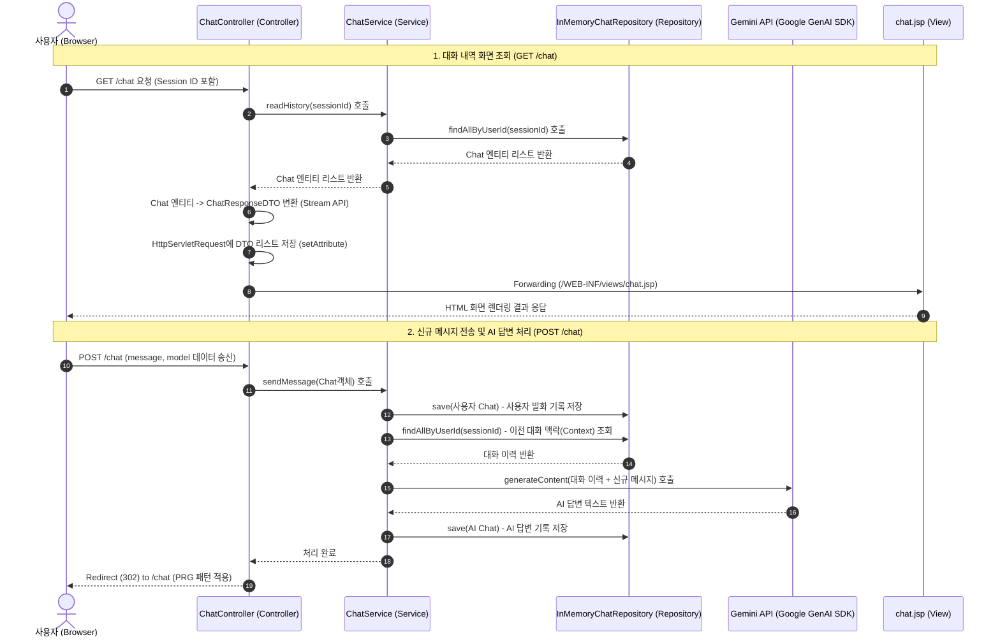

# Step 1: MVC 패턴으로 구현하는 AI 챗봇 아키텍처

본 문서는 `step1_mvc` 단계를 통해 구현된 **Jakarta Servlet API 기반의 AI 챗봇 서비스**의 구조와 핵심 원리를 정리한 개발 가이드입니다. 

---

## 1. 🍽️ 초심자를 위한 비유: "AI 레스토랑"으로 이해하는 MVC

MVC(Model-View-Controller) 패턴이 생소하다면, **"주문받는 레스토랑"**을 떠올려보세요.

```
[ 손님 (브라우저) ]  ----(1. 주문 / 메시지 전송)---->  [ 점원 (Controller) ]
        ▲                                                    │
        │                                         (2. 주문 전달 / 로직 실행)
  (5. 음식 서빙)                                              ▼
        │                                            [ 주방장 (Service) ]
        │                                                    │
        │                                           (3. 재료 조회 및 조리)
        │                                                    ▼
 [ 플레이팅 (View / JSP) ] <---(4. 요리 완성)--- [ 냉장고 및 창고 (Repository/DB) ]
```

* **Client (손님)**: 웹 브라우저를 통해 질문을 입력하고 답변을 기다리는 사용자입니다.
* **Controller (점원 - `ChatController`)**: 손님의 요청(주문)을 직접 받고, 이에 대응하는 적절한 주방장(Service)을 호출합니다. 요리가 나오면 완성된 화면(View)을 손님에게 보여줍니다.
* **Service (주방장 - `ChatService`)**: 실질적으로 요리를 만드는 핵심 업무(비즈니스 로직)를 담당합니다. 손님의 질문을 해석하고, AI 모델에 질문을 던져 답변을 가공합니다.
* **Repository (재료 창고/냉장고 - `InMemoryChatRepository`)**: 요리에 필요한 식자재나 대화 기록 데이터를 저장하고 꺼내오는 저장소입니다.
* **Model/DTO (음식 재료/도시락 통 - `Chat`, `ChatResponseDTO`)**: 주방과 점원 사이에서 데이터를 실어 나르는 데이터 규격입니다.
* **View (접시/플레이팅 - `chat.jsp`)**: 완성된 요리를 손님이 먹기 좋게 이쁜 그릇에 담아내는 렌더링 화면입니다.
* **Session (단골 보너스 카드 - `HttpSession`)**: 단골 손님이 올 때마다 고유 번호를 확인하여, "이 손님이 방금 전에 무슨 음식을 주문했었는지(대화 이력)"를 기억하게 해주는 열쇠입니다.

---

## 2. ⚙️ 주니어를 위한 원리 설명

### 2.1. 전체 실행 흐름 (Sequence Diagram)

사용자가 브라우저를 통해 `/chat`으로 접속하고 메시지를 보낼 때, 시스템 내부에서 발생하는 데이터의 흐름은 다음과 같습니다.



---

### 2.2. 아키텍처 구성 요소 및 역할

이번 단계에서 설계된 MVC 컴포넌트의 명확한 역할 분담은 아래 표와 같습니다.

| 컴포넌트명 | 주요 클래스 | 역할 | 특징 |
| :--- | :--- | :--- | :--- |
| **Controller** | `BaseController`<br>`ChatController` | 클라이언트 요청(HTTP Request) 수신, 파라미터 검증, 서비스 레이어 호출, 뷰(JSP) 포워딩 및 리다이렉트 제어 | `HttpServlet`을 상속받으며 톰캣 컨테이너에 의해 라이프사이클이 관리됨 (`@WebServlet` 사용) |
| **Service** | `ChatService` | 실제 핵심 비즈니스 로직 수행, 트랜잭션 단위 정의(추후 확장 시), AI API 연동 및 데이터 가공 | 싱글톤 패턴으로 구현되어 재사용되며, Repository에 의존함 |
| **Repository** | `ChatRepository` (Interface)<br>`InMemoryChatRepository` | 데이터베이스나 인메모리 저장소와의 직접적인 데이터 CRUD 처리 | `ConcurrentHashMap` 기반의 스레드 세이프 인메모리 저장 방식 채택 |
| **Model / DTO** | `Chat` (Record)<br>`ChatResponseDTO` | 계층 간 데이터 전달 및 도메인 데이터 구조 표현 | Java 14의 `record`를 활용해 불변성 확보. DTO에는 뷰 렌더링에 적합한 Getter 및 정적 팩토리 메서드(`of`) 포함 |
| **View** | `chat.jsp` | Controller가 가공하여 Request Attribute에 담아둔 데이터를 받아 HTML로 변환 | JSTL(`c:forEach`, `c:if`) 및 JSP EL(`${chat.message}`)을 사용하여 동적 바인딩 |
| **Config** | `GenAIConfig` | Google GenAI SDK를 사용하기 위한 클라이언트 인스턴스 생성 및 공통 파라미터(System Instruction 등) 설정 | 환경변수(`GEMINI_API_KEY`) 로드 및 API 호출 기본값 설정 |

---

### 2.3. 핵심 기술 원리 분석

#### ① 서블릿(Servlet) 라이프사이클과 싱글톤(Singleton) 자원 관리
* **서블릿 (`ChatController`)**: 톰캣(Servlet Container)에 의해 관리됩니다. 첫 요청 시 `init()` 메서드가 수행되며 단 한 번 인스턴스가 생성되고(싱글톤처럼 작동), 이후 다수의 스레드가 `service() -> doGet()/doPost()`를 호출합니다.
* **비즈니스 자원 (`ChatService`, `InMemoryChatRepository`)**: 톰캣이 자동으로 의존성을 주입(DI)해주지 않는 순수 자바 환경이므로, **싱글톤 디자인 패턴**을 직접 구현(`getInstance()`)하여 static 영역에 단 하나의 인스턴스만 상주하도록 제어했습니다.
  ```java
  // ChatService.java의 싱글톤 구현 예시
  private ChatService() {
      this.chatRepository = InMemoryChatRepository.getInstance(); // 느슨한 결합 지향
  }
  private static final ChatService instance = new ChatService();
  public static ChatService getInstance() {
      return instance;
  }
  ```

#### ② Forward vs Redirect와 PRG(Post-Redirect-Get) 패턴
* **Forward (전달)**: `req.getRequestDispatcher().forward(req, resp)`
  * 서버 내부에서 `Servlet`이 요청과 응답 객체를 유지한 채로 `JSP`로 제어권만 넘깁니다. 
  * 주소창의 URL은 `/chat` 그대로 유지되며, 클라이언트는 서버 내부의 이동을 알지 못합니다.
  * 주로 **데이터를 화면에 출력할 때(조회 - GET)** 사용합니다.
* **Redirect (재방문)**: `resp.sendRedirect(...)`
  * 서버가 브라우저에게 "302 Found" 응답과 함께 "새로운 URL로 다시 요청하라"고 지시합니다.
  * 브라우저는 새로운 GET 요청을 보내기 때문에 URL 주소창이 변경됩니다.
  * **PRG 패턴**: 사용자가 POST 요청(메시지 전송)을 한 뒤 Forward를 하게 되면, 브라우저에서 '새로고침'을 눌렀을 때 동일한 POST 요청이 중복 전송되는 문제가 발생합니다. 이를 막기 위해 **POST 요청 완료 후 항상 리다이렉트(GET /chat)를 시켜 새로고침 시 단순 조회만 수행되도록 방지**합니다.

#### ③ Session을 통한 다중 사용자 식별
* 인메모리 방식의 한계를 극복하기 위해 `req.getSession().getId()`를 사용하여 개별 브라우저 세션의 고유 식별자를 Key로 사용합니다.
* 이를 통해 서버 인스턴스가 1개이더라도 각기 다른 브라우저 세션을 가진 사용자가 서로의 대화 기록을 침범하지 않고 독립적인 챗봇 경험을 가질 수 있게 설계되었습니다.

#### ④ Java Record와 JSP EL(Expression Language)의 연동 이슈
* Java 14+의 `record` 타입(예: `ChatResponseDTO`)은 전통적인 Java Beans 규약(Getter가 `getXxx()` 형태인 것)과 달리, 필드명과 동일한 `owner()`, `message()` 형태의 getter를 자동으로 생성합니다.
* 하지만 구버전 JSP EL 파서나 JSTL 태그 라이브러리는 규약에 따라 `${chat.owner}`를 찾을 때 `getOwner()` 메서드를 리플렉션으로 호출하려 시도하므로 작동에 실패할 수 있습니다.
* 이를 해결하기 위해 `ChatResponseDTO`에 수동으로 표준 getter 메서드들을 오버라이딩하여 EL 파서가 데이터를 정상적으로 읽어가도록 보완했습니다.
  ```java
  public record ChatResponseDTO(String owner, String model, String message, String timestamp) {
      // JSP EL 및 표준 Java Beans 규약 지원을 위해 명시적으로 getter 정의
      public String getOwner() { return owner; }
      public String getModel() { return model; }
      public String getMessage() { return message; }
      public String getTimestamp() { return timestamp; }
  }
  ```

---

## 3. 💬 면접 대비를 위한 예상 질문 & 답변 (Deep Dive)

### Q1. Servlet에서 Forward와 Redirect의 구조적 차이점과 실제 활용 사례에 대해 설명해주세요.
> **답변:**  
> **Forward**는 서버 내부의 이동 방식으로, 클라이언트가 보낸 요청(`HttpServletRequest`)과 응답(`HttpServletResponse`) 객체를 그대로 공유하여 제어권을 다른 서블릿이나 JSP로 넘깁니다. 따라서 주소창의 URL이 변하지 않고, 클라이언트는 서버 내부의 이동을 알지 못합니다. 주로 특정 조건에 맞는 데이터를 가공하여 화면(JSP)에 뿌려주는 **조회 및 렌더링 목적**으로 사용합니다.  
> 반면, **Redirect**는 서버가 클라이언트에게 `302 Status Code`와 `Location` 헤더를 담아 응답하여, 클라이언트가 완전히 새로운 요청을 보내게 만듭니다. 이 과정에서 Request 객체는 소멸 후 새로 생성되며 주소창의 URL도 새 주소로 변경됩니다. 대표적으로 회원가입이나 글 쓰기 등 **서버 상태를 변경하는 POST 작업 완료 후 중복 제출을 막기 위해 리다이렉트시키는 PRG(Post-Redirect-Get) 패턴**에 주로 활용됩니다.

---

### Q2. `InMemoryChatRepository`에서 멀티스레드 환경을 고려해 `ConcurrentHashMap`을 사용하셨습니다. 그렇다면 현재 코드는 스레드 안전(Thread-safe)한가요? 한계점이 있다면 무엇이고 어떻게 보완할 수 있을까요?
> **답변:**  
> `ConcurrentHashMap`을 사용하여 맵 객체 자체에 대한 동시 접근과 `computeIfAbsent()` 메서드를 통한 버킷 레벨의 동기화는 안전하게 처리됩니다. 하지만 **맵 내부의 값(Value)으로 사용 중인 `ArrayList`는 Thread-safe하지 않은 한계점**이 있습니다.
> ```java
> private final ConcurrentHashMap<String, List<Chat>> chatMap = new ConcurrentHashMap<>();
> 
> @Override
> public void save(Chat chat) {
>     chatMap.computeIfAbsent(
>             chat.sessionId(),
>             k -> new ArrayList<>() // ◀ 멀티스레드 동시 접근 시 ArrayList의 동기화 문제 발생 가능
>     ).add(chat);
> }
> ```
> 만약 동일한 세션 ID를 가진 요청이 다중 스레드 환경에서 동시에 들어와 `add(chat)`를 수행할 경우, `ArrayList` 내부의 데이터 유실이나 `ArrayIndexOutOfBoundsException`이 발생할 위험이 있습니다.  
> 이를 보완하기 위해 리스트 자체를 스레드 안전한 구현체로 변경해야 합니다. 데이터 추가가 빈번한 환경이므로 `Collections.synchronizedList(new ArrayList<>())`를 사용하거나, 읽기 작업이 많다면 `CopyOnWriteArrayList`로 대체하는 것이 안전합니다.
> ```java
> // 개선안 예시
> chatMap.computeIfAbsent(
>         chat.sessionId(),
>         k -> Collections.synchronizedList(new ArrayList<>())
> ).add(chat);
> ```

---

### Q3. JSP 파일들을 왜 `webapp/` 폴더 바로 아래가 아닌 `WEB-INF/views/` 폴더 아래에 두었나요?
> **답변:**  
> `WEB-INF` 디렉토리는 서블릿 스펙상 **클라이언트가 브라우저 주소창을 통해 직접 주소를 입력하여 정적 자원에 접근하는 것을 강제로 차단하는 보호 구역**입니다.  
> 만약 JSP 파일이 일반 공개 디렉토리에 열려있다면 사용자가 서블릿 컨트롤러를 거치지 않고 직접 JSP 파일에 접근하여 에러를 보거나 잘못된 데이터를 렌더링받을 수 있습니다.  
> 따라서 JSP 파일들을 `WEB-INF/views/`에 위치시키고, 오직 `ChatController`와 같은 서블릿의 포워딩(`forward()`)을 통해서만 이 뷰 템플릿에 접근할 수 있도록 통제함으로써 **애플리케이션의 MVC 흐름을 강제하고 보안성을 대폭 높일 수 있습니다.**

---

### Q4. 디자인 패턴 관점에서, 지금 작성한 Controller가 Service를 싱글톤 객체로 주입받는 현재 방식의 아쉬운 점과 향후 Spring Framework의 IoC/DI를 도입하면 어떻게 개선되는지 설명해주세요.
> **답변:**  
> 현재 코드에서는 `ChatController`의 `init()` 메서드 내부에서 `ChatService.getInstance()`를 호출하고 있고, `ChatService` 내부에서도 `InMemoryChatRepository.getInstance()`를 직접 코출하여 구체 클래스 간에 **강한 결합(Tight Coupling)**이 형성되어 있습니다. 이 방식은 Repository 구현체를 RDB 기반이나 외부 API 기반으로 교체하려 할 때 관련 클래스의 소스코드를 직접 수정해야 하므로 OCP(개방-폐쇄 원칙)를 위배하게 됩니다.  
> 향후 **Spring IoC/DI**를 도입하면, 컨트롤러나 서비스가 스스로 다른 객체를 직접 찾아 가져오지 않고 Spring Container가 설정 정보를 바탕으로 실행 시점에 알맞은 의존 객체를 주입(Dependency Injection)해 줍니다. 이 경우 컴포넌트들은 구체 클래스가 아닌 **인터페이스에만 의존(DIP 위배 해결)**하면 되므로, 코드 수정 없이 설정 파일이나 어노테이션 교체만으로 유연하게 모듈을 갈아끼울 수 있어 유지보수성과 테스트 용이성이 극적으로 개선됩니다.

---

### Q5. DTO(Data Transfer Object)와 Domain Model(Entity)을 굳이 분리하여 사용하는 이유는 무엇인가요?
> **답변:**  
> 데이터베이스 레코드나 핵심 비즈니스 개념을 정의하는 **도메인 모델(Entity)**과 화면이나 API 스펙에 맞춘 **DTO**는 관심사가 다릅니다. 이 둘을 분리하지 않고 하나의 모델 객체로 혼용하면 다음과 같은 문제가 생깁니다.
> 1. 화면의 일시적인 요구사항(예: 날짜 포맷 변경, 필드 숨김 등) 때문에 핵심 비즈니스 엔티티 코드가 수정되어 취약해집니다.
> 2. 도메인 모델에 포함된 핵심 민감 데이터(비밀번호, 내부 ID 등)가 그대로 뷰/클라이언트에 노출되는 보안 위협이 생깁니다.
> 3. 현재의 `ChatResponseDTO`와 같이 JSP EL 파서 스펙 호환을 위해 Getter 메서드를 구체화해야 하는 기술적 요구가 발생했을 때, 도메인 모델 자체를 수정할 필요 없이 DTO에서만 이를 유연하게 처리할 수 있습니다.
> 
> 따라서 관심사를 분리(Separation of Concerns)하여 **도메인 모델은 순수하게 비즈니스 규칙과 데이터 정합성 보존에 집중**하게 만들고, **DTO는 전송 프로토콜과 화면 요구사항에 맞춘 유연한 변화를 감당**하게 설계하는 것이 장기적으로 유지보수하기 유리합니다.
