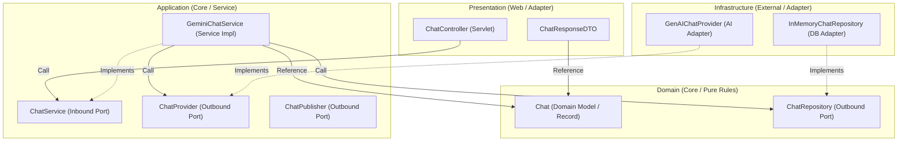

# Step 2: 헥사고날(클린) 아키텍처로 진화하는 AI 챗봇

본 문서는 `step2_clean` 단계를 통해 구현된 **헥사고날 아키텍처(Hexagonal Architecture, 일명 Ports and Adapters)** 기반의 AI 챗봇 서비스의 설계 구조와 핵심 설계 사상을 설명합니다.

---

## 1. 🔌 초심자를 위한 비유: "조립식 컴퓨터"로 이해하는 헥사고날 아키텍처

전통적인 소프트웨어 설계가 부품들이 접착제로 단단히 붙어있는 "일체형 모니터 컴퓨터"라면, 헥사고날 아키텍처는 완벽하게 규격화된 **"조립식 컴퓨터"**와 같습니다.

```
                  [ 🔌 USB 포트 (Inbound Port: ChatService) ]
                                      ▲
                                      │ (연결)
          [ 🖱️ 마우스 / ⌨️ 키보드 (Presentation Adapter: ChatController) ]
                                      │
                                      ▼
    =====================================================================
    ||                                                                 ||
    ||                [ 💻 메인보드 & CPU (Domain & Application) ]        ||
    ||                                                                 ||
    =====================================================================
                                      ▲
                                      │ (연결)
             [ 🔌 PCIe 포트 / SATA 포트 (Outbound Port: ChatProvider) ]
                                      │
                                      ▼
           [ 💾 SSD / 📹 그래픽카드 (Infrastructure Adapter: GenAIChatProvider) ]
```

* **메인보드와 CPU (Core - Domain & Application)**: 컴퓨터의 본질적인 연산과 비즈니스 로직을 처리하는 핵심 장치입니다. 그래픽카드가 어떤 브랜드인지, 마우스가 무선인지 유선인지 관심이 없습니다. 오직 자신의 표준 연산 규칙에만 집중합니다.
* **표준 포트 (Ports - `ChatService`, `ChatProvider`, `ChatRepository`)**: 메인보드에 뚫려 있는 **USB 단자, PCIe 슬롯, SATA 단자**와 같습니다. 규격(Interface)만 정의되어 있으며, 무엇이 꽂힐지는 알지 못합니다.
* **외부 장치 (Adapters - `ChatController`, `GenAIChatProvider`, `InMemoryChatRepository`)**: 포트 규격에 맞춰 조립되는 부품들입니다.
  * **마우스/키보드 (Presentation Adapter)**: 사용자의 입력을 받아 컴퓨터에 신호를 전달(Inbound)합니다.
  * **SSD/그래픽카드 (Infrastructure Adapter)**: 본체 내부 연산 결과를 화면에 출력하거나 보관(Outbound)합니다.
* **부품 교체의 유연성**: 그래픽카드를 Nvidia에서 AMD로 교체(예: 메모리 DB를 실제 DB로 교체)하더라도 메인보드(비즈니스 로직)는 뜯어고칠 필요가 없습니다. PCIe 슬롯(Port) 규격만 맞추면 언제든 플러그인(Plug-in)하여 작동시킬 수 있습니다.

---

## 2. ⚙️ 주니어를 위한 원리 설명

### 2.1. 아키텍처 의존성 구조도 (Dependency & Class Diagram)

헥사고날 아키텍처의 핵심은 **"의존성의 방향이 항상 외부에서 내부(도메인)로 흐른다"**는 것입니다.



---

### 2.2. 인바운드(Inbound)와 아웃바운드(Outbound) 포트/어댑터 매핑

헥사고날 아키텍처의 컴포넌트는 상호작용의 방향에 따라 크게 두 그룹으로 나뉩니다.

| 구분 | 역할 | 프로젝트 내 클래스 | 특징 |
| :--- | :--- | :--- | :--- |
| **Inbound Port**<br>(Driving Port) | 외부의 자극(HTTP 요청 등)을 받아 애플리케이션 코어를 구동하는 명세 | `ChatService` (인터페이스) | 애플리케이션 코어 내부(`application.service` 또는 `domain.service`)에 정의됨 |
| **Inbound Adapter**<br>(Driving Adapter) | 외부 진입점으로부터 요청을 해석하여 코어 포트를 호출하는 구체 구현체 | `ChatController` (서블릿) | 프레임워크 기술(웹, HTTP)에 종속적이며 Presentation 영역에 상주 |
| **Outbound Port**<br>(Driven Port) | 애플리케이션 코어가 작업을 수행하기 위해 외부 인프라를 호출하는 명세 | `ChatRepository`, `ChatProvider`<br>(인터페이스) | 비즈니스 목적을 정의하므로 코어 도메인/애플리케이션 패키지 내에 존재 |
| **Outbound Adapter**<br>(Driven Adapter) | 아웃바운드 포트 규격을 실제로 구현하여 외부 기술과 직접 통신하는 구현체 | `InMemoryChatRepository`, `GenAIChatProvider` | 데이터베이스 연결, 외부 API 연동(Gemini SDK) 등 구체적인 인프라 기술을 은닉함 |

---

### 2.3. 핵심 기술 원리 분석

#### ① 의존성 역전 원칙 (DIP)을 통한 비즈니스 로직 보호
전통적인 레이어드 아키텍처에서는 비즈니스 레이어가 데이터베이스 접근 클래스에 직접 의존하여 DB 기술이 바뀌면 비즈니스 코드도 같이 오염되는 부작용이 있었습니다.  
헥사고날 아키텍처는 이를 **인터페이스(Port)**로 격리합니다.
* **의존성 방향**: `GenAIChatProvider (Infrastructure)` ➔ `ChatProvider (Application/Port)`
* `GeminiChatService`는 구체적인 API 호출 라이브러리(Google GenAI SDK)에 대해 일절 알지 못하며, 단지 추상화된 포트(`ChatProvider`)만 바라봅니다. 덕분에 향후 OpenAI나 Claude 등 다른 AI API로 변경하더라도 비즈니스 로직 클래스는 단 한 줄도 수정할 필요가 없습니다.

#### ② 관심사 분리(SoC)의 극대화: 서비스와 인프라의 완전 격리
`step1_mvc`에서는 `ChatService`가 직접 Gemini SDK의 `Client`, `Content`, `Part` 등의 객체를 다루며 API 결과를 파싱하고 예외를 잡았습니다.  
`step2_clean`에서는 이 인프라 성격의 연동 코드가 모두 `GenAIChatProvider`로 이전되었습니다.

```java
// [개선전] step1_mvc - ChatService.java가 직접 SDK 다룸 (결합도 높음)
try (Client client = GenAIConfig.getClient()) {
    GenerateContentResponse response = client.models.generateContent(chat.model(), contents, GenAIConfig.getGenerateContentConfig());
    return response.text();
}

// [개선후] step2_clean - GeminiChatService.java (순수 비즈니스 오케스트레이션에만 집중)
@Override
public void save(Chat chat) {
    chatRepository.save(chat); // 1. 유저 발화 저장
    List<Chat> history = chatRepository.findAllByUserId(chat.userId()); // 2. 히스토리 조회
    String aiResponse = chatProvider.useAI(chat, history); // 3. 외부 API 호출 (포트에 위임)
    Chat aiChat = new Chat(aiResponse, "AI", chat.userId(), chat.model(), ZonedDateTime.now().toString());
    chatRepository.save(aiChat); // 4. AI 답변 저장
}
```

---

## 3. 💬 면접 대비를 위한 예상 질문 & 답변 (Deep Dive)

### Q1. 헥사고날 아키텍처와 전통적인 레이어드(Layered) 아키텍처의 가장 큰 차이점은 무엇인가요?
> **답변:**  
> 가장 큰 차이는 **의존성의 흐름**과 **데이터베이스(인프라)를 바라보는 관점**에 있습니다.  
> 전통적인 레이어드 아키텍처는 `Presentation ➔ Business ➔ Data Access` 구조로 계층이 수직적으로 쌓여 있어, 비즈니스 계층이 하위의 데이터 액세스 계층에 직접 의존하게 됩니다. 이로 인해 데이터베이스 기술이나 설계에 비즈니스 로직이 종속되는 경향이 짙어집니다.  
> 반면, 헥사고날 아키텍처는 **비즈니스 도메인을 중심(Core)에 두고 동등한 외곽 영역으로 프레젠테이션과 인프라를 배치**합니다. 코어는 포트(인터페이스)를 통해서만 소통하고 구체적인 외부 기술은 어댑터로 구현되어 플러그인처럼 결합됩니다. 즉, **의존성 역전 원칙(DIP)**을 활용해 모든 의존성이 외부에서 중심(도메인)으로 향하게 만들어 데이터베이스나 외부 API의 변경사항이 비즈니스 로직을 전혀 오염시키지 못하도록 보호합니다.

---

### Q2. 헥사고날 아키텍처에서 포트(Port)를 인바운드(Inbound)와 아웃바운드(Outbound)로 나누는 기준과 각각의 역할을 설명해주세요.
> **답변:**  
> 포트를 나누는 기준은 **"애플리케이션 코어를 기준으로 통신이 시작되는 주체와 방향이 어디인가"**입니다.
> * **인바운드 포트(Driving Port)**: 외부 환경이 애플리케이션 코어를 호출(구동)하는 통로입니다. 본 프로젝트의 `ChatService` 인터페이스가 이에 해당하며, 컨트롤러(어댑터)가 사용자의 HTTP 요청을 해석해 인바운드 포트를 호출하여 비즈니스 로직을 시작시킵니다.
> * **아웃바운드 포트(Driven Port)**: 애플리케이션 코어가 동작 과정 중에 필요에 의해 외부 환경(DB, API 등)을 호출하는 통로입니다. 본 프로젝트의 `ChatRepository`나 `ChatProvider` 인터페이스가 해당하며, 코어가 필요로 하는 데이터 영속성이나 AI 연동 기능을 인터페이스 규격으로 선언하고, 인프라 어댑터가 이를 실제로 구현하여 작동합니다.

---

### Q3. 헥사고날 아키텍처의 장점을 취하는 대가로 지불해야 하는 단점(Trade-off)에는 무엇이 있을까요?
> **답변:**  
> 가작 큰 단점은 **구조적 복잡성 증가(Over-engineering의 위험)**입니다.  
> 단순한 CRUD 중심의 비즈니스 웹 서비스인 경우, 굳이 포트 인터페이스를 정의하고 매핑 레이어(DTO 변환 등)를 두는 구조는 불필요한 보일러플레이트 코드와 클래스 파일들의 양산으로 이어져 초기 개발 속도를 저하시킵니다. 또한 코어 영역과 어댑터 영역 사이에서 데이터 모델을 일일이 매핑 및 변환해 주는 오버헤드가 발생하여 코드의 직관성을 다소 떨어뜨릴 수 있습니다. 따라서 도메인 비즈니스 규칙이 복잡하고 변화가 빈번할 때 도입하는 것이 효과적입니다.

---

### Q4. 도메인 모델인 `Chat` 레코드의 `sessionId` 필드를 `userId`로 변경했습니다. 만약 헥사고날 아키텍처를 적용하지 않은 이전 프로젝트였다면 이 영향이 어디까지 미쳤을 것이고, 헥사고날에서는 이를 어떻게 흡수하나요?
> **답변:**  
> 헥사고날 아키텍처를 도입하지 않은 강결합 구조라면, 도메인 객체가 DB 스키마 및 화면에 직접 노출되는 경우가 많습니다. 이 경우 필드명 변경 시 **DB 테이블 컬럼명 변경, SQL Mapper/JPA 엔티티 맵핑 수정, 컨트롤러 파라미터 수신 코드, 그리고 최종 뷰단(JSP/EL 등)에 이르기까지 모든 계층의 코드가 깨지는 연쇄적인 파급 효과(Shotgun Surgery)**가 발생합니다.  
> 헥사고날 아키텍처 하에서는 외부 경계(어댑터)마다 변환 장치(DTO 매핑 등)를 두어 코어를 방어합니다. 설령 도메인 내부 필드명이 변경되더라도 프레젠테이션 어댑터의 DTO(`ChatResponseDTO`)나 인프라 어댑터에서만 맵핑 방식을 매끄럽게 교정해주면 외부 API 스펙이나 DB 구조를 즉각적으로 붕괴시키지 않고 내부 도메인의 변화를 안전하게 격리할 수 있습니다.
